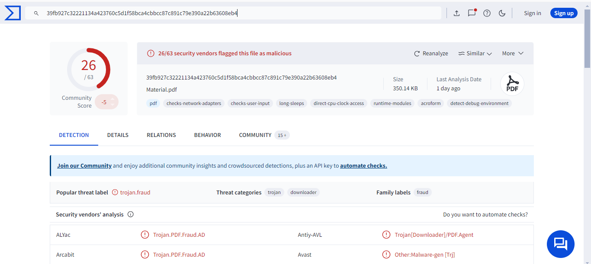

# Phishing Mail Detected - Suspicious Task Scheduler

## Overview
This repository contains the analysis and investigation of SOC Event ID 82, triggered by the detection of a phishing email attempting to use a suspicious task scheduler. The phishing email was blocked before it reached the recipient, but further analysis showed it contained malicious content.

- **EventID**: 82
- **Event Time**: Mar 21, 2021, 12:26 PM
- **Rule**: SOC140 - Phishing Mail Detected - Suspicious Task Scheduler
- **SMTP Address**: 189.162.189.159
- **Source Email**: aaronluo@cmail.carleton.ca
- **Destination Email**: mark@letsdefend.io
- **Subject**: COVID19 Vaccine
- **Device Action**: Blocked

## Investigation Steps

### 1. SMTP Address Analysis
Upon searching the SMTP Address in Talos Intelligence, we see the email is routed through Mexico, yet it claims to be from Canada. This discrepancy is obviously suspicious and suggests potential email spoofing.

### 2. Email with Attachment
The email, which used the subject "COVID19 Vaccine," had an attached ZIP file. This is a common method used in phishing attacks to lure recipients into opening malicious files.

### 3. ZIP File and PDF Analysis
Inside the ZIP file, we found a PDF document. VirusTotal results confirmed that the PDF was malicious and associated with the domains `a.pomf.cat`. These domains are known for hosting harmful content.

### 4. Malicious PDF Hyperlinks
Upon opening the PDF in a sandbox environment, several hyperlinks were found inside the document. All the hyperlinks pointed to `https://a.pomf.cat/hgfetb.R11`, which is associated with WINRAR. When visiting the link, we encountered a message saying ‘pomf.cat is shutting down for the moment due to a surge of CSAM (Child Sexual Abuse Material).’

### 5. Log Management Analysis
In the Log Management section, a search for the SMTP Address (189.162.189.159) showed one exchange with the destination address `172.16.20.3`.

### 6. Endpoint Security Analysis
Further analysis of the Exchange server (172.16.20.3) in the Endpoint Security tool revealed that it was functioning as an Exchange server, but no significant information was gathered from the processes running on the server at the time of the investigation.

## Conclusion
This was a **True Positive** phishing event. The email was successfully blocked, preventing any potential damage. The phishing attempt used COVID-19 vaccine news as a lure, and the attachment contained malware.

---
